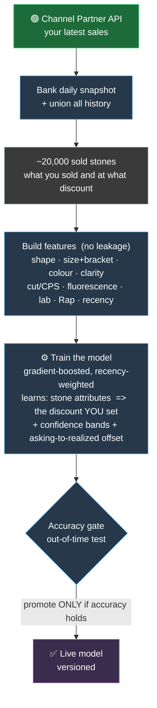
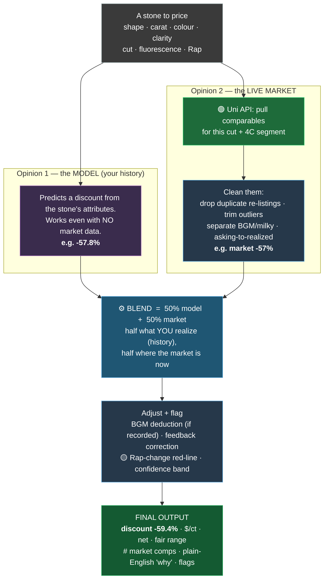

# GlowStar AI Pricing — How It Works

The system runs **two processes**. **Process 1** *learns* (once a night).
**Process 2** *prices* (every request). The price is a **50/50 blend of two
independent opinions** — the model (your history) and the live market.

**Legend:**  🟢 live API   🟡 fed / scheduled file   ⚙️ computed

---

## Process 1 — Nightly Training  *(builds the model)*

> Training fetches your **sales** (Channel Partner). It does **not** fetch the
> market — that happens at pricing time.

---

## Process 2 — Pricing a Stone  *(runs the model + live market, every request)*

> If the live market is unavailable it falls back to the banked aggregate — it
> never invents data. For a stone with **no** comparables, the **model alone**
> sets the price (that is what the model is for).

---

## Where every number comes from

| Used at | Source | Live / static |
|---|---|---|
| Training — your sales | Channel Partner API | 🟢 live, nightly |
| Pricing — market comps | Uni API | 🟢 live, per stone |
| Pricing — the model | versioned trained model | 🟢 refreshed nightly |
| Rap (your stones) | comes in your records | 🟢 live |
| Rap (new stones, no price) | versioned Rapaport list | 🟡 fed weekly* |
| Fallback market (if Uni down) | banked Uni aggregate | 🟡 periodic rebuild |

\* No live Rapaport API exists for us; the list is fed weekly (or via RapNet
when provisioned). The **Rap-change red-line fires automatically** once a new
list is loaded.

---

## In one sentence

**(In production)Every night the system re-learns your pricing from your latest sales; every
time it prices a stone it runs that model *and* pulls the live market, then
blends them, so the price reflects what *you* would realize, kept current by
where the market is now, and ships with a range, a reason, and honest flags.**
